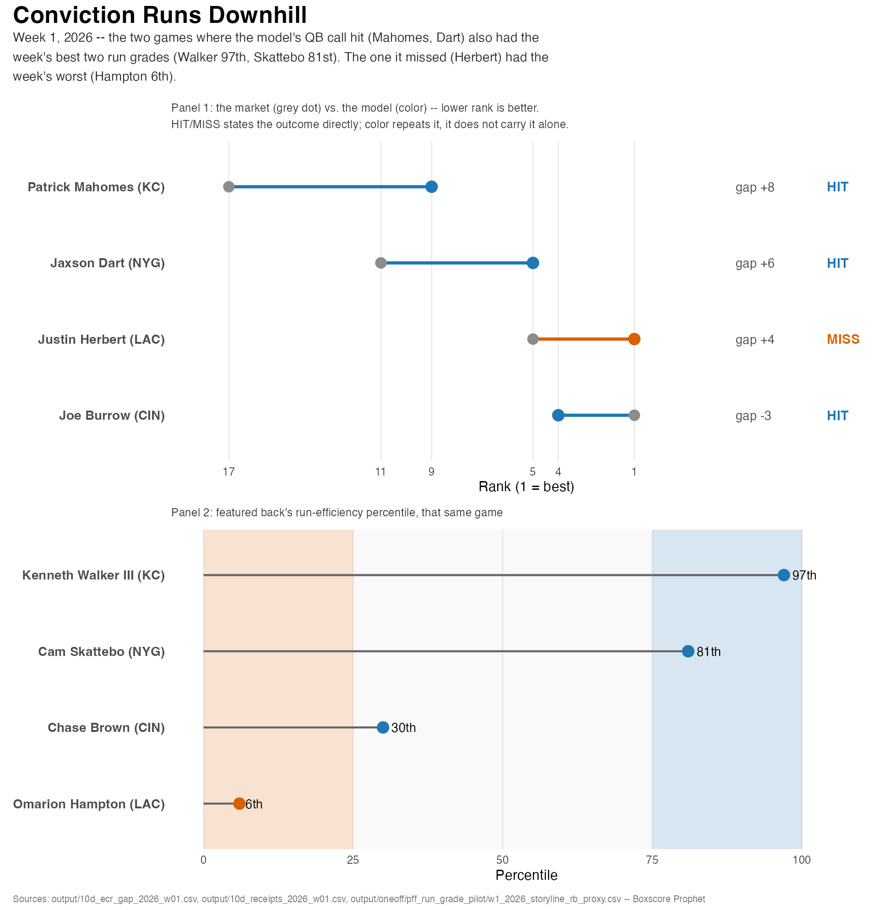

# Four Scores And One Week Ago
 
The headlines write themselves after Week 1: the Giants looked "strong," Cincinnati "survived," Kansas City looked "scary good", and the Chargers looked "lost."  Four scores, four narratives, and the question worth asking is whether the box score actually backs up the story.  Maybe an even more important question, did our model have a hint that any of it was coming before kickoff? 
 
## They Might Be Giants
 
Jaxson Dart went 23-of-29 for 230 yards and 3 touchdowns with zero picks, along with adding 54 yards on the ground.  He posted a passing EPA of +21.9 with a CPOE of +13.4, the best mark of any quarterback in the four games we tracked this week. Stat Nerd alert! EPA is Expected Points Added, or how many points a play added or cost the offense, compared to what an average play would be expected to do in that same down/distance/field-position situation.  CPOE is Completion % Over Expected, or how much better or worse a QB completed passes than expected, given how difficult each individual throw was (depth, coverage, etc.).  Effectively, it's a QB accuracy stat that adjusts for degree of difficilty.

The Giants' offense as a whole was the best of the games we looked at, with +0.243 EPA per play and a 56.5% success rate. Another definition please!  Success rate is the share of plays that gained enough yards to keep the offense on *"schedule"*. We acutally had Dart six full spots ahead of the Expert Consensus Ranking (model rank 5 versus an ECR of 11), our biggest gap of the week in the "we like him more than the market does" direction. It hit. For his part, Cam Skattebo also hit with 18 carries for 81 yards and a score.  He landed in the 81st percentile on our internal run-efficiency read. So, the Giants win wasn't some fluky shootout; it was a genuinely efficient offense the market was underpricing.
 
## Tenacious D
 
Going into Week 1, there were significant questions about whether or not the Bengals defense would be good enough to allow Burrow to contend.  Well, a funny thing happened on the way to *The Jungle*, Burrow actually missed his normal 20 fantasy point bar: 25-of-35 for 254 yards, 1 touchdown, 1 interception, a passing EPA of -2.6, and just 14.2 PPR points. ECR had him #1 overall, but we had a start probability of just 43.9%. A coinflip, not a lock, and the skepticism paid off. 

The ground game didn't really contribute on offense either.  Chase Brown's 16 carries for 56 yards graded in the 30th percentile in run efficiency.  So, who actually won this game? The defense, kind of. They turned the Bucaneers over four times (the worst turnover game of the week) and had four sacks, but they still allowed 27 points and a 52.6% success rate. It was opportunistic, but not shutdown-good.  Cincinnati won on takeaways, full stop, while its two best offensive weapons both had quiet days.
 
## Be Afraid. Be Very Afraid.

Mahomes turned in 21.7 PPR points with 2 passing touchdowns and a rushing score. The real story is the team number: Kansas City's offensive EPA per play was +0.071 in Week 1, nearly double their +0.039 rate across all of 2025. The defense matched it, holding Denver to -0.235 EPA per play, the best defensive mark of any of the four highlighted storylines. They had a pick and four sacks to go with it. Our model had Mahomes ranked 9th against an ECR of 17, the largest model-versus-market gap of the entire quartet this week, and it hit. But the real story was Kenneth Walker III racking up 173 yards and a touchdown, landing him in the 97th-percentile in run-efficiency. When both sides of the ball outperform their own baseline this much, "scary" might actually be underselling it.
 
## Charger-ing
 
Herbert went 17-of-27 for 209 yards, 1 touchdown and 1 interception, took 3 sacks, and posted a passing EPA of -5.6, the worst quarterback mark of the group. Our model's single highest-conviction call of the week was Herbert over the field (model rank 1 versus an ECR of 5), and it busted.  We were buying the Mike McDaniel offensive hype, and it bit us.  This wasn't a Herbert-only problem: the Chargers' team offense was the worst of the four at -0.227 EPA per play and a 38.6% success rate.  This was actually below their already-mediocre 2025 baseline of -0.013. Omarion Hampton's 12 carries for 43 yards landed in the 6th percentile, the worst run-efficiency profile in this set. It was a step back for the whole offense, not just a bad game from the quarterback our model liked most.

Lay all four games side by side and the QB call and the run game moved together every time: hit paired with a top-tier run grade twice, and the one miss paired with the week's worst one.

---
 
Three hits, one miss, and alot of numbers that might be new to you.  Week 1 is in the books, and our scores for Week 2 are waiting on Earnest to populate.  Somehow he keeps failing up.  
 
*Method: pre-week model ranks (model_rank vs. ECR) compared against actual Week 1 outcomes; EPA, CPOE, and success rate via nflverse/nflreadr; run-efficiency percentiles from our internal public-data model. Full technical writeup at [github.com/merrittocratic/boxscore-prophet](https://github.com/merrittocratic/boxscore-prophet).*